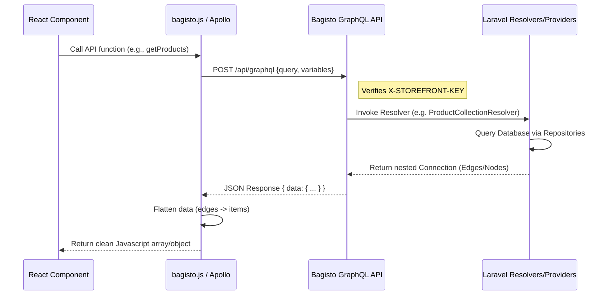

# Bagisto GraphQL Integration: Data Flow Documentation

This document provides a technical overview of how data flows between the **Next.js Frontend** and the **Bagisto (Laravel) Backend** using GraphQL.

---

## 1. Connection Architecture

The communication is built on top of **API Platform** on the Laravel side, providing a Headless Commerce layer.

- **Endpoint**: `http://localhost:8000/api/graphql` (POST)
- **Primary Header**: `X-STOREFRONT-KEY` — Required for all requests to authorize the storefront.
- **Transport Layers**:
    - **Native Fetch API**: Used in `bagisto.js` for most site-wide queries.
    - **Apollo Client**: Used in specialized pages like `/search` for advanced state and caching.

---

## 2. Global Data Flow Cycle



---

## 3. Query Catalog: Which data where?

### A. Catalog: List Products (`GetProducts`)
- **Passed From Frontend**: 
    - `first`: Number of items to fetch.
    - `query`: Search string.
    - `filter`: Filter criteria (e.g., category slug).
- **Returned From Backend**: 
    - A connection object with `edges` containing `node` (the product data).
- **Data Path**: 
    - Frontend: `bagisto.js` -> `catalogApi.getProducts()`
    - Backend: `ProductCollectionResolver.php` fetches from `ProductRepository`.

### B. Catalog: Single Product (`GetProduct`)
- **Passed From Frontend**: 
    - `id`, `sku`, or `urlKey`.
- **Returned From Backend**: 
    - Detailed product object including `images` (edges), `reviews`, and `description`.
- **Data Path**: 
    - Frontend: `bagisto.js` -> `catalogApi.getProduct()`
    - Backend: `SingleProductBagistoApiResolver.php` fetches a single model.

### C. Category: Hierarchical Tree (`getCategoriesTree`)
- **Passed From Frontend**: None (Implicit storefront channel).
- **Returned From Backend**: 
    - Recursive category tree.
- **Data Path**: 
    - Backend Provider: `CategoryTreeProvider.php`

---

## 4. Where Data is "Caught" (Frontend Processing)

Because Bagisto's GraphQL structure follows the Relay specification (using `edges` and `node` for pagination), the frontend uses utility functions to simplify the data for UI components.

### Flattening Utility
Located in `bagisto.js`:
```javascript
function connectionToItems(connection) {
  return connection?.edges?.map((edge) => edge.node) ?? [];
}
```
**Example Flow**:
1. Raw Response: `{ data: { products: { edges: [ { node: { name: "Shirt" } } ] } } }`
2. After Processing: `[ { name: "Shirt" } ]`
3. UI: Maps over the clean array to render `<ProductCard />`.

---

## 5. Environment Requirements
Ensure your `.env.local` contains these keys for the data flow to function:
```env
NEXT_PUBLIC_BAGISTO_ENDPOINT=http://localhost:8000
NEXT_PUBLIC_BAGISTO_GRAPHQL_ENDPOINT=http://localhost:8000/api/graphql
NEXT_PUBLIC_BAGISTO_STOREFRONT_KEY=your_key_here
```
